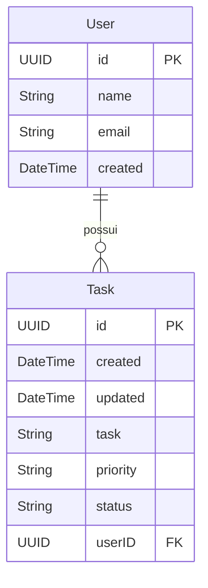

# Gerenciador de Tarefes

Para este exemplo minimalista pretendemos construir um aplicativo de gerenciamento de tarefas.

## Aula - Criação de Base de Dados SQLITE

Utilizamos ORM em python SQLAlchemy e o gerenciador de migrações Alembic.

Com esses passos você irá criar uma base SQLite e fazer CRUD nos objetos relacionais, seguindo o Diagrama Entidade Relacionamento (DER) a seguir:

Passos realizados na aula:

1. `pip install alembic sqlalchemy`

2. `python -m alembic init migration`
   
3. Criar pasta `data_models`, os arquivos `data_models/__init__.py` e `data_models/models.py`

4. No arquivo `alembic.ini`, ajustar o endereço da variável `sqlalchemy.url`, o endereço deve ficar:
`sqlite:///base_tarefas.db`

5. Em `migration/env.py`, Ajustar o caminho do objeto `Base` que estabelece a estrutura dos modelos 

6. Criação de modelos declarativos `User` e `Task` no arquivo `data_models/models.py`

7. Criar versão da base de dados utilizando o código 
`python -m alembic revision --autogenerate -m "Adicionados modelos User e Task."`

8. Aplicar a versão do models na base `python -m alembic upgrade heads`
   
9. Conectar com a base de dados, Inserir dados, Realizar leitura no terminal

10. Criar arquivo com funções de leitura e escrita em `crud/crud.py`

11. Criar código de chamada das funções de CRUD `/controlador.py`